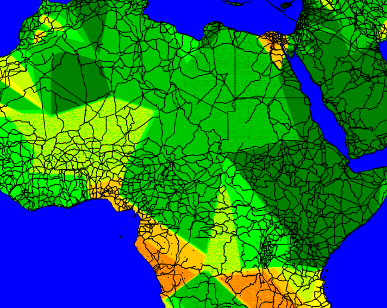

# heatchmap

`map/map_gpd_rasterio.ipynb` is relevant

### Problems

For low density of points far away averaging them works poorly because calculation are on really small numbers (tail of normal distribution). We get hard edges:

